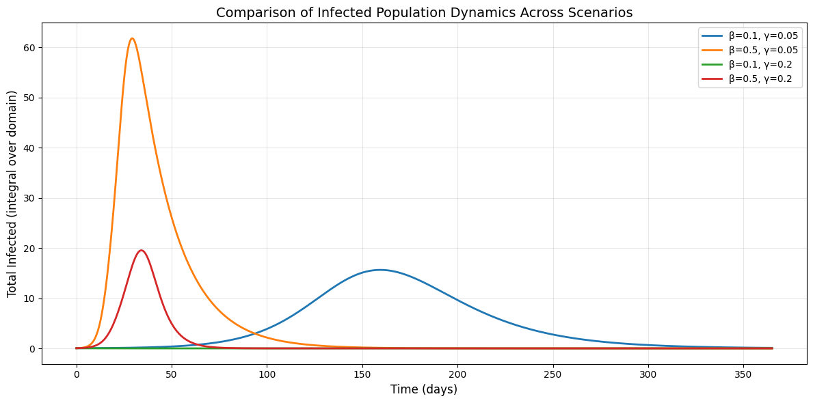
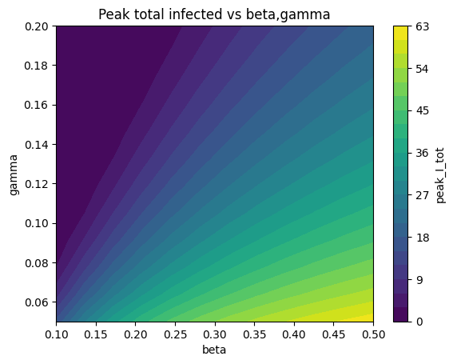
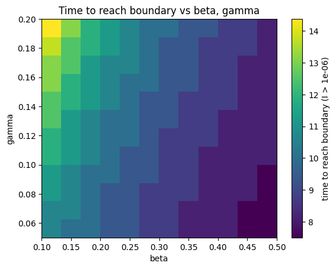

# Introduction

In this project we study a spatially extended SIR model to investigate the spatial spread of an infectious disease in dependence of model parameters and diffusion rates. Further analysis beyond this report can be found in the accompanying Jupyter Notebook.

# Model Formulation

We consider a spatially distributed population in two dimensions over time and model the spread of an infectious disease. The population density $N(x,y,t)$ is conserved globally and composed of three compartments: Susceptible $(S)$, Infectious $(I)$, and Recovered $(R)$. The PDE system is given by:

\begin{align}
\frac{\partial S}{\partial t} &= D_s \nabla^2 S -\beta \frac{S I}{N}, \tag{1}\\
\frac{\partial I}{\partial t} &= D_i \nabla^2 I + \beta \frac{S I}{N} - \gamma I, \tag{2}\\
\frac{\partial R}{\partial t} &= \gamma I. \tag{3}
\end{align}

With the following parameters:

-   $\beta > 0$: transmission rate (time$^{-1}$)\
-   $\gamma > 0$: recovery rate (time$^{-1}$)\
-   $D_s \ge 0$: diffusion coefficient of susceptible individuals (space$^2$/time)
-   $D_i \ge 0$: diffusion coefficient of infected individuals (space$^2$/time)

The infection term $\beta \frac{SI}{N}$ transfers individuals from $S$ to $I$, and the recovery term $\gamma I$ transfers individuals from $I$ to $R$. The diffusion terms in $S$ and $I$ model random movement of individuals, leading to the spatial spread of the disease.

The spatial SIR model defined by equations 1 to 3 is a time-dependent, non-linear reaction-diffusion system. The Laplacian operator $\nabla^2$ in the diffusion terms makes the system second-order and the coupling term $\beta \frac{SI}{N}$ makes it non-linear, as the dependent variables $S$ and $I$ are multiplied.

# Model Assumptions and Choices

To simulate the system, we make the following assumptions and choices:

-   Finite Difference Scheme: We employ the Forward-Time Central-Space (FTCS) scheme (Rabbani et al., 2020). This explicit method simulates the state at $t_i$ directly from the known values at $t_{i-1}$, while spatial derivatives ($\nabla^2$) are approximated using the central finite difference method (Leveque, 2007).
-   Boundary Conditions: We assume an isolated population with no movement in or out of the defined space. This is enforced with Neumann boundary conditions (no-flux is implemented by equating boundary values to their neighbouring interior values) to the compartments $S$ and $I$ - $R$ does not diffuse (Leveque, 2007).
-   Initial Conditions: The model is initialized with a uniformly distributed susceptible population and a small localized concentration of infected individuals $(I)$ is planted in the center of the grid to simulate the outbreak.
-   Parameter Choices: Model parameters are assumed to be constant. Separate diffusion coefficients allow to model different behaviours of Susceptible $(S)$ and Infected $(I)$ individuals. Parameter values are chosen based on the given typical values in the project description and varied to explore their influence on the model.

# Discretisation

Space is discretised on a uniform grid with spacings $h = \Delta x = \Delta y$ and time with step size $\Delta t$. The differential operators are approximated as follows:

-   Spatial Discretisation: The Laplacian operator $\nabla^2 u$ in the diffusion term is approximated using a five-point stencil, which is second-order accurate. For any grid point (i,j):

$$
\nabla^2u_{i,j} \approx \frac{u_{i+1,j}+u_{i-1,j}+ u_{i,j+1}+u_{i,j-1}-4u_{i,j}}{h^2}
$$

-   Time Stepping: We use the explicit Forward Euler method to advance the solution in time. Following the general discrete-time formulation $x_{n+1}=f(x_n)$ the state at the next time step is computed directly from the current values: 
    $$
    u^{n+1} = u^n + \Delta t \cdot \frac{\partial u^n}{\partial t}
    $$

Numerical boundary conditions are enforced by the previously mentioned Neumann boundary conditions.

# Stability and Error Analysis

-   Step-wise Order of Error: The FTCS scheme combines a forward difference in time ($\mathcal{O}(\Delta t)$) and a central difference in space ($\mathcal{O}(h^2)$). Hence, the local truncation error of the approximation scales like $\mathcal{O}(\Delta t,h^2)$ (Leveque, 2007).

-   Stability Condition: As an explicit method, the FTCS scheme is only conditionally stable. To ensure numerical stability, the time step $\Delta t$ is constrained by the diffusion limit (the time step must be sufficiently small relative to the spatial grid size): $\Delta t \le \frac{1}{2D\left(\frac{1}{\Delta x^2} + \frac{1}{\Delta y^2}\right)}$

    This restriction follows from a method of lines stability analysis. Spatial discretisation of the diffusion term leads to a linear ODE system $\dot{\mathbf{u}} = D\,L\,\mathbf{u}$, where $L$ is the discrete Laplacian matrix. Forward Euler time integration is stable only if the condition $1 + \Delta t\,D\,\lambda \in [-1,1]$ is satisfied for all eigenvalues $\lambda$ of $L$, whose largest magnitude scales as $4(\Delta x^{-2} + \Delta y^{-2})$, yielding the stated restriction on $\Delta t$ (Leveque, 2007). In our implementation an additional safety factor of $0.5$ was applied to this limit.

# Implementation

The model simulates disease spread across a 100×100 grid using the finite difference method. Rather than treating the population as one large group, it tracks how the disease spreads spatially, as if observing it move across a map. Each cell tracks susceptible (S), infected (I), and recovered (R) populations. Diffusion between neighbouring cells is controlled by coefficients $D_s$ and $D_i$, with zero-flux Neumann boundaries.

## Initial Conditions Setup

Separate grids were created for each state (S, I and R). The infected population (1% of total) was initialized at the grid center using a Gaussian distribution, with susceptible individuals (99%) uniformly distributed and recovered population initially zero.

## Time stepping routine

The model uses the Euler method, following a step-wise approach. The time step was chosen to ensure numerical stability. The maximum stable time step was calculated as $dt_{\text{max}} = \frac{1}{2 \cdot D_{\text{max}} \cdot (\frac{1}{dx^2} + \frac{1}{dy^2})}$. The actual time step used was $dt = 0.5 \times dt_{\text{max}}$, incorporating a safety factor of 0.5 to prevent the solution from becoming unstable during the simulation.

At each time step implemented in the sir_step function, Neumann boundary conditions were applied to the susceptible and infected populations. The total population was calculated as $N = S + I + R$, and the reaction terms for infection ($\beta \frac{SI}{N}$) and recovery ($\gamma I$), as well as the diffusion terms ($\nabla^2 S$ and \$\\nabla\^2 I\$), were computed using finite differences.

All populations were then updated according to $S^{n+1} = S^n + dt \cdot (D_s \nabla^2 S - \text{infection})$, $I^{n+1} = I^n + dt \cdot (D_i \nabla^2 I + \text{infection} - \text{recovery})$, and $R^{n+1} = R^n + dt \cdot \text{recovery}$. Any negative values were set to zero to ensure physical validity.

## Simulation of the PDE

The simulation was initiated by the `run_simulation` function, which combined all the model's components. This function initialised the spatial grids with the defined initial conditions and set the epidemiological parameters ($\beta$ and $\gamma$) and the diffusion coefficients ($D_s$ and $D_i$). Four scenarios were simulated over 365 days (\~73,000 steps). Snapshots were saved every 50 steps for analysis.

| Scenario 1 | Scenario 2 | Scenario 3 | Scenario 4 |
|------------------|------------------|------------------|------------------|
| low $\beta$ low $\gamma$ | high $\beta$ low $\gamma$ | low $\beta$ high $\gamma$ | high $\beta$ high $\gamma$ |

# Stability Investigation

\begin{wrapfigure}{r}{0.43\textwidth}
\vspace{-20pt}
\centering
\includegraphics[width=\linewidth]{images/stability_check.png}
\caption{Stability investigation of the time stepping restriction.}
\label{fig:stability-investigation}
\vspace{-10pt}
\end{wrapfigure}

We tested the stability restriction described in Section 5 by running the same simulation with two different time steps:  $\Delta t = 0.5\Delta t_{\max}$ (stable), and $\Delta t = 1.5\Delta t_{\max}$ (unstable), illustrated in Figure \ref{fig:stability-investigation}. With the stable time step the solution remains finite and non-negative. Once the time step exceeds the theoretical maximum value the solution explodes and becomes non-finite at $t \approx 67.9$, indicating that the time step violates the restriction and the model becomes numerically unstable.

Additionally, we repeated the simulation on a refined grid where $\Delta x$ and $\Delta y$ were halved, while choosing $\Delta t$ according to the stability restriction. We compared the final infected field $I(x,y,t_{\max})$ using the discrete 2-norm of the grid function (analogue $L^2$-norm), which describes the area weighted difference after interpolation of the fine-grid solution to the coarse grid. The difference measured was $1.35 \times 10^{-21}$, indicating that the model is insensitive to this grid refinement for the chosen parameters (Leveque, 2007).

# Parameter Studies

A comparison of the infected population dynamics across the four scenarios is given in @fig-lineplot-population. It is evident that the worst-case scenario was characterised by a high $\beta$ and a low $\gamma$ (in Orange), while the best-case scenario (no outbreak) was characterised by the opposite conditions (in Green).

{#fig-lineplot-population fig-align="center" width="14.1cm"}

In order to illustrate spatial evolution, all four scenarios were plotted as heat-maps. With each row representing a scenario and each column a time point. Each heatmap utilises its own scale to visualise the spatial spread of infection; it should be noted that row three ($\beta=0.1$, $\gamma=0.2$) demonstrates the least spread despite its visual output (see @fig-spatial-heatmap).

::: {#fig-comparison layout-ncol="2"}
{#fig-peak-total-I}

{#fig-test}

Comparison of infection dynamics parameters
:::

The findings of @fig-lineplot-population and @fig-spatial-heatmap indicate that the transmission rate ($\beta$) significantly impacts the spread of the disease to a greater degree than the recovery rate ($\gamma$). This could also be demonstrated in @fig-comparison in the left plot, which shows that higher $\beta$ values lead to dramatically increased peak infections, while changes in $\gamma$ have minimal effect. Similarly, the time-to-boundary plot, on the right, demonstrates that $\beta$ primarily determines how quickly the infection spreads spatially, with the disease reaching boundaries fastest at high $\beta$, and minimal impact of $\gamma$ values.

{#fig-spatial-heatmap fig-align="center" width="645"}

# References

## Literature

LeVeque, R. J. (2007). Finite Difference Methods for Ordinary and Partial Differential Equations. Society for Industrial and Applied Mathematics. https://doi.org/10.1137/1.9780898717839 

Rabbani, H. S., Osei-Bonsu, K., Abbasi, J., Osei-Bonsu, P. K., & Seers, T. D. (2020). Modelling The Spread of COVID-19 Using The Fundamental Principles of Fluid Dynamics (p. 2020.06.24.20139071). medRxiv. https://doi.org/10.1101/2020.06.24.20139071

## Use of AI tools

Github Copilot and Anthropic's Claude model were used in supporting manner for code development, debugging and visualization.