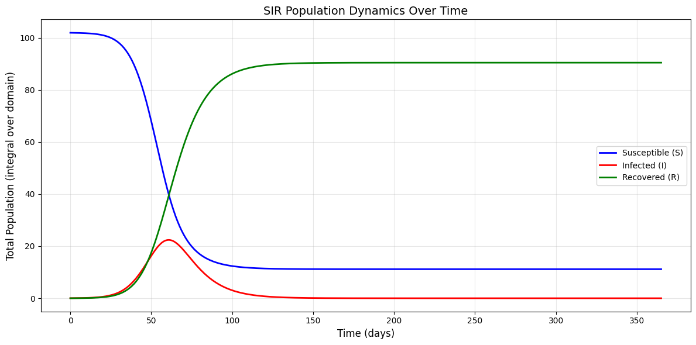
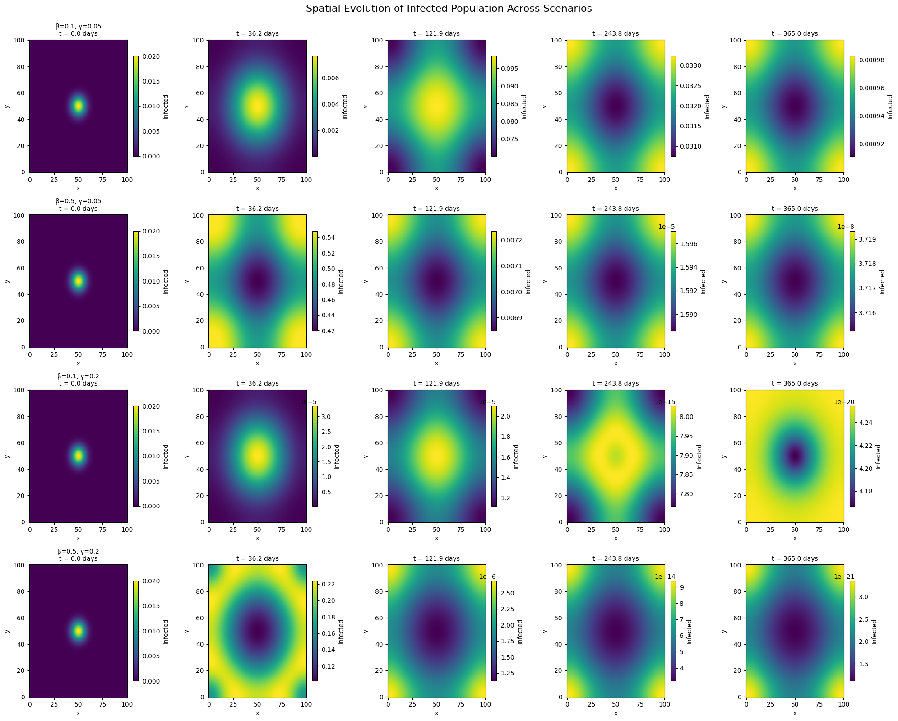

# Introduction

In this project we consider a spatial version of the Susceptible-Infectious-Recovered (SIR) model. ... Maybe not needed ?

# Model Formulation

We consider a spatially distributed population in two dimensions over time.

## Variables and Parameters

**State variables:**

-   $S(x,y,t)$: density of susceptible individuals\
-   $I(x,y,t)$: density of infectious individuals\
-   $R(x,y,t)$: density of recovered individuals

The local total population densitiy is then given by:

$$
N(x,y,t) = S(x,y,t) + I(x,y,t) + R(x,y,t).
$$

**Parameters:**

-   $\beta > 0$: transmission rate (time$^{-1}$)\
-   $\gamma > 0$: recovery rate (time$^{-1}$)\
-   $D_s \ge 0$: diffusion coefficient of susceptible individuals (space$^2$/time)
-   $D_i \ge 0$: diffusion coefficient of infected individuals (space$^2$/time)

The PDE System used, represents spatial movement for the infected compartment through the diffusion rate $D_i$ and for the susceptible compartment through $D_s$.

## PDE System

The spatial SIR model is defined by the following PDE system:

$$
\begin{align}
\frac{\partial S}{\partial t} &= D_s \nabla^2 S -\beta \frac{S I}{N}, \tag{1}\\
\frac{\partial I}{\partial t} &= D_i \nabla^2 I + \beta \frac{S I}{N} - \gamma I, \tag{2}\\
\frac{\partial R}{\partial t} &= \gamma I. \tag{3}
\end{align}
$$

where the infection term $\beta \frac{SI}{N}$ transfers individuals from $S$ to $I$, and the recovery term $\gamma I$ transfers individuals from $I$ to $R$. The diffusion terms in $S$ and $I$ model random movement of susceptible and infectious individuals in space, which leads to the spatial spread of the disease.

## Classification of the PDE

The spatial SIR model defined by equations 1 to 3 is a time-dependent, non-linear reaction-diffusion system. The laplacian operator $\nabla^2$ in the diffusion terms make the system second-order and the coupling term $\beta \frac{SI}{N}$ makes it non-linear, as the dependent variables $S$ and $I$ are mutliplied.

# Model Assumptions and Choices

## FD scheme

The spatial SIR system is solved with a finite difference method on a cartesian grid. With a one-step forward update, time is simluated explicitly - the state at $t_i$ is computed directly from the known values at $t_{i-1}$. The spatial derivatives ($\nabla^2$) are approximated using the central finite difference method. Hence, the system is solved using the Forward-Time Central-Space (FTCS) scheme.

Add citation to Leveque and https://www.medrxiv.org/content/10.1101/2020.06.24.20139071v2.full

## Boundary conditions

For the diffusing compartments $S$ and $I$ we apply Neumann boundary conditions to ensure isolation, such that no individuals enter or leave through the space of interest.

In the discrete implementation, the no-flux condition is enforced by equating boundary values to their adjacent interior values, which yields a vanishing normal derivative at the boundary in the finite-difference sense. (MAYBE THIS PARAGRPAH IS NOT NEEDED)

## Initial conditions

To simulate the spread of an infectious disease the initial conditions were set such that the population is mostly susceptible, with a small "drop" of infected persons concentrated in the middle of the space and zero recovered individuals. This represents an outbreak starting locally and spreading with diffusion.

## Parameter choices

Model parameters are assumed to be constant. Separate diffusion coefficients allow to simulate different different mixture levels between the Susceptible ($S$) and Infected ($I$) compartment. Parameter values are chosen based on the given typical values from the project description.

Parameter magnitudes are varied to explore their influence on the spread patterns and peak infection levels.

# Discretisation

## Finite difference discretisation (FD)

Space is discretised on a uniform grid with spacings $\Delta x$ and $\Delta y$ and time with step size $\Delta t$. Like that continuous fields are approximated with discrete grid points and partial derivatives are replaced by finite differences.

## Laplacian operator (2D)

The two-dimensional Laplace operator is defined as the sum of second derivatives in each coordinate direction, $\nabla^2 u = \partial_{xx}u + \partial_{yy}u.$ We discretise $\partial_{xx}u$ and $\partial_{yy}u$ using second-order central differences and sum them to obtain a discrete Laplacian on the grid. Resulting in a 5-point stencil, where every grid point is defined as: $$
\Delta^2u_{i,j} \approx \frac{u_{i+1,j}-2u_{i,j}+u_{i-1,j}}{\Delta x^2}+\frac{u_{i,j+1}-2u_{i,j}+u_{i,j-1}}{\Delta y^2}
$$

Since we use $\Delta x = \Delta y$ we can consider $\Delta x = \Delta y \equiv h$ for simplicity. Hence the 5-point stencil can be defined as:

$$
\Delta^2u_{i,j} \approx \frac{u_{i+1,j}+u_{i-1,j}+ u_{i,j+1}+u_{i,j-1}-4u_{i,j}}{h^2}
$$

Add citation to Leveque

## Boundary conditions utilities

The no-flux boundary condition previously mentioned is enforced by setting each boundary value equal to its closest interior neighbor. This dissolves the one-sided normal derivative at the boundary, while keeping interior update formulas unchanged.

# Order of Error

## Step-wise order of the FD approximation

The forward time discretisation is first-order accurate in time. Hence, the error scales like $\mathcal{O}(\Delta t)$. The spatial discretisation used for the diffusion terms are second-order accurate, yielding errors of order $\mathcal{O}(\Delta x^2)$ and $\mathcal{O}(\Delta y^2)$ respectively.

For stable choices of the time step, i.e. the time step is sufficiently small relative to the spatial grid sizes, the error decreases as $\Delta t \to 0$ and $\Delta x, \Delta y \to 0$. Specifically, the time step must satisfy: $\Delta t \le \frac{1}{2D\left(\frac{1}{\Delta x^2} + \frac{1}{\Delta y^2}\right)}$

$\Delta t \le C \Delta x^2$

# Implementation

The model simulates the spread of disease across a two-dimensional grid, in which each cell can be susceptible (S), infected (I) or recovered (R). Rather than treating the population as one large group, it tracks how the disease spreads spatially, as if observing it move across a map.

The model uses the finite difference method to calculate how people (and therefore disease) move between neighbouring cells. The model therefore looks at each cell and its four neighbours. The diffusion coefficient describes the speed of diffusion between neighbours. This triggers a diffusion effect, where the high concentration naturally flows towards the lower concentration. The model was set up with zero-flux Neumann boundaries.

Three specific situations occurred for each time step. First, susceptible persons became infected as a result of contact with an infected person. Infected persons recovered based on the recovery rate (γ). The three populations (S, I and R) moved around the grid.

## Initial Conditions Setup

The model was initialised with a spatial domain of a 100x100 grid representing a 10,000-cell square area.

Separate grids were created for each state (S, I and R). The infected population started with a small number of infected individuals located in the centre of the grid (1% of the total population). The susceptible population (99% of the total population) was distributed equally across the grid and the recovered population was initially zero everywhere.

The infection was introduced using a Gaussian distribution. This created a smooth circular infection zone that gradually disappeared from the centre outwards.

## Time stepping routine

The model uses the Euler method, following a step-wise approach. The model used the Euler method in a stepwise manner. The time step was chosen to ensure numerical stability. The maximum stable time step was calculated as dt\_(max) = 1/(2·D\_(max) · (1/dx² + 1/dy²)). The actual time step used was dt = 0.5 × dt\_(max), incorporating a safety factor of 0.5 to prevent the solution from becoming unstable during the simulation.

At each time step implemented in the sir_step function, Neumann boundary conditions were applied to the susceptible and infected populations. The total population was calculated as N = S + I + R, and the reaction terms for infection (β·S·I/N) and recovery (γ·I), as well as the diffusion terms (∇²S and ∇²I), were computed using finite differences.

All populations were then updated according to the following equations:

-   S\^(n+1) = S\^n + dt·(D_s·∇²S - infection)

-   I\^(n+1) = I\^n + dt·(D_i·∇²I + infection - recovery)

-   R\^(n+1) = R\^n + dt·recovery

Any negative values were set to zero to ensure physical validity.

## Simulation of the PDE

The simulation was initiated by the `run_simulation` function, which combined all the model's components. This function initialised the spatial grids with the defined initial conditions and set the epidemiological parameters (β and γ) and the diffusion coefficients (D_s and D_i). Four different scenarios were simulated to compare disease dynamics under varying conditions.

-   Low β, Low γ: Slow spread, slow recovery
-   High β, Low γ: Fast spread, slow recovery
-   Low β, High γ: Slow spread, fast recovery
-   High β, High γ: Fast spread, fast recovery

The function executed the time loop by repeatedly calling the `sir_step` function to advance the solution forward in time.

The simulation ran for roughly 73,000 time steps, which simulated 365 days. Snapshots were saved every 50 steps for visualisation and analysis. This process was repeated in steps to observe the spatial and temporal evolution of the disease across the grid.

# Stability Investigation

dt_max detlat

Grid x 0.15 (lösung nicht mehr stimmen)

# Parameter Studies

The following plot shows the impact of different transmission (β) and recovery (γ) rates on the spatial dynamics. Each row shows a different scenario. These scenarios are described in the section "Simulation of the PDE". Each column shows a different day. The countdown begins at day 0 and ends at day 365. Each scenario begins with a small number of infected individuals in the middle.

The plot clearly shows that when transmission is low and the recovery rate is high, the number of infected people on the last day was the highest. It can be observed that a high transmission causes the disease to spread faster towards the edges, while a low transmission keeps the infected population for a longer time concentrated in the middle.

{fig-align="center"}
